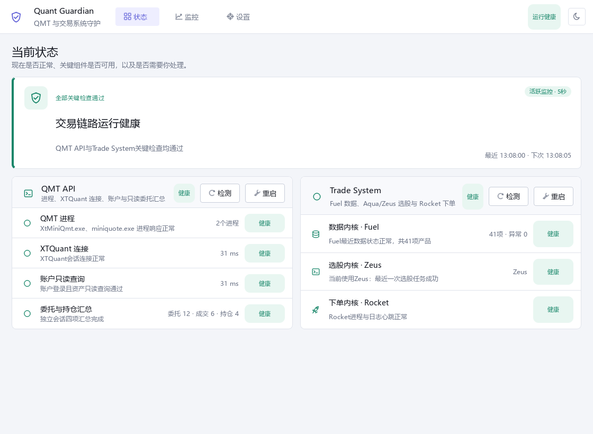
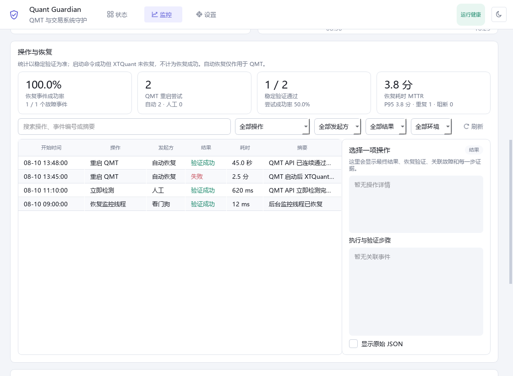
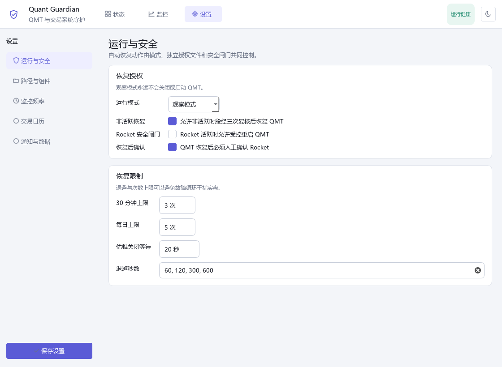

# Quant Guardian

> A safety-first Windows monitor for QMT and Quantclass environments, with controlled **QMT-only** recovery.

Quant Guardian 是一个独立的 Windows 桌面监控工具，用于观察 QMT API、XTQuant 只读链路与 Quantclass 交易系统内核。它在严格的连续故障证据和安全闸门同时成立时，只对 QMT 执行受控恢复。

> **公开预览版提示：** v0.3.0-beta.1 尚未进行代码签名，Windows SmartScreen 可能提示未知发布者。应用默认处于观察模式；在实盘环境启用自动恢复前，必须完成本机验证并理解风险。

## 界面预览

### 状态：当前健康与是否需要操作

*模拟数据，不含真实账户信息。*

### 监控：趋势、恢复统计与操作明细

*模拟数据，不含真实账户信息。*

### 设置：自动恢复安全闸门

*模拟数据，不含真实账户信息。*

## 下载

从 [GitHub Releases](https://github.com/Samadhi-Chi/quant-guardian/releases) 下载最新的 Windows x64 预览版：

- Quant-Guardian-v0.3.0-beta.1-windows-x64.zip
- Quant-Guardian-v0.3.0-beta.1-SHA256SUMS.txt
- Quant-Guardian-v0.3.0-beta.1-SBOM.cdx.json

下载后先核对 SHA-256，再解压到普通用户目录。ZIP 是可移植 one-folder 包，不包含 QMT、XTQuant、Quantclass、真实配置、日志或监控数据库。

## 能力与边界

| 范围 | 监控内容 | Quant Guardian 可自动执行的动作 |
|---|---|---|
| QMT API | QMT 进程、XTQuant 会话、账户只读查询、委托/成交/持仓数量摘要 | 在安全条件满足时受控重启 QMT |
| Trade System · 数据 | Fuel 最近任务、数据新鲜度、状态文件与增量日志 | 仅监控和提示 |
| Trade System · 选股 | 当前选择的 Aqua 或 Zeus、最近选股结果与交易计划新鲜度 | 仅监控和提示 |
| Trade System · 下单 | Rocket 进程、日志心跳与执行状态 | 仅监控和提示 |

Quant Guardian 不是交易策略，不会生成交易计划，不会下单或撤单。Aqua 与 Zeus 是可切换的选股内核；Rocket 是唯一的下单内核。自动恢复永远不会启动、停止或修复 Quantclass、Fuel、Aqua、Zeus 或 Rocket。

## 快速开始

### 使用 Release

1. 下载 ZIP 和 SHA256SUMS.txt。
2. 在 PowerShell 中校验：

~~~powershell
Get-FileHash .\Quant-Guardian-v0.3.0-beta.1-windows-x64.zip -Algorithm SHA256
~~~

3. 解压后直接运行 Quant Guardian\Quant Guardian.exe，或使用包内加固后的 scripts\install-app.ps1 安装到当前用户目录。
4. 在设置页填写本机 QMT 与 Quantclass 路径；保持观察模式运行至少一个完整交易日。

### 从源码运行

~~~powershell
git clone https://github.com/Samadhi-Chi/quant-guardian.git
cd quant-guardian
powershell.exe -NoProfile -ExecutionPolicy Bypass -File .\scripts\bootstrap.ps1 -Dev
.\.venv\Scripts\python.exe -m quant_guardian --simulate
.\.venv\Scripts\python.exe -m quant_guardian
~~~

源码支持 Python 3.11–3.14 x64。XTQuant 原生探针运行在独立的 Python 3.11 子进程中，不导入到主 UI 进程。

## 兼容性

当前实测基线：

| 组件 | 已验证版本 | 说明 |
|---|---:|---|
| Windows | Windows 10 / 11 x64 | 仅支持 Windows |
| QMT | 2.0.23.0 | 其他版本未验证 |
| Quantclass Client | 4.1.1 | 可选，仅监控 |
| XTQuant | 250807.1.2 | 独立 Python 3.11 探针 |
| Python 源码运行 | 3.11–3.14 x64 | Release 使用 Python 3.14 构建 |

这些版本是测试基线，不是兼容承诺。详见 [兼容性说明](docs/COMPATIBILITY.md)。

## 安全模型

- 默认观察模式，不执行自动恢复。
- 自动恢复需要 mode=recover、未过期授权和内容完全匹配的本机哨兵。
- QMT 关键链路需在 45 秒内累计三次一致失败，并排除外部网络、Trade System 单独异常和日志单独异常。
- 恢复前再次核验 PID、进程创建时间和可执行文件路径；PID 复用、路径不匹配或同名进程均不得终止。
- Rocket 活跃时默认阻止自动 QMT 恢复。
- 人工重启必须由操作员点击确认；它不绕过进程身份和并发锁保护。
- 诊断导出会遮蔽账户、token、用户名和 QMT/Quantclass 本机根路径。

完整设计见 [安全模型](docs/SAFETY_MODEL.md)。安全问题请按 [SECURITY.md](SECURITY.md) 私下报告，不要提交包含真实账户或日志的公开 Issue。

## 与 Quantclass、QMT 的关系

Quant Guardian 是独立、非官方的兼容工具，与量化小讲堂/Quantclass、迅投/QMT、任何券商均不存在隶属、合作或背书关系。

本项目不包含、不复制、不修改、也不再分发 Quantclass Client Pro、QMT 或 XTQuant。用户必须自行取得这些软件，并遵守各自许可与服务条款。

[Quantclass Client Pro](https://github.com/qtcls/quantclass-client-pro) 当前采用 BUSL-1.1，是 **source-available（源码可见）** 项目，并明确声明当前不是 Open Source；其许可在 2028-08-22 前不提供生产使用授权。该项目及许可证不属于 Quant Guardian 的 Apache-2.0 授权范围。

## 开发与文档

- [安装与卸载](docs/INSTALLATION.md)
- [架构](docs/ARCHITECTURE.md)
- [安全模型](docs/SAFETY_MODEL.md)
- [兼容性](docs/COMPATIBILITY.md)
- [排障](docs/TROUBLESHOOTING.md)
- [开发与测试](docs/DEVELOPMENT.md)
- [贡献指南](CONTRIBUTING.md)
- [第三方声明](THIRD-PARTY-NOTICES.md)

常用命令：

~~~powershell
.\.venv\Scripts\python.exe -m pytest --cov=quant_guardian --cov-report=term-missing
.\.venv\Scripts\python.exe -m ruff check .
.\.venv\Scripts\python.exe -m bandit -c pyproject.toml -r src -ll
powershell.exe -NoProfile -ExecutionPolicy Bypass -File .\scripts\test-install-safety.ps1
powershell.exe -NoProfile -ExecutionPolicy Bypass -File .\scripts\build.ps1
~~~

## 许可证与风险

Quant Guardian 自有代码采用 [Apache License 2.0](LICENSE)，版权为 Copyright 2026 Joe.Sun。第三方组件继续受各自许可证约束，见 [THIRD-PARTY-NOTICES.md](THIRD-PARTY-NOTICES.md) 与 licenses/。

本项目涉及实盘交易基础设施，但不提供任何收益、可用性或适用性保证。使用者需自行验证路径、账户、交易日历、恢复阈值和券商客户端行为，并承担运行风险。
